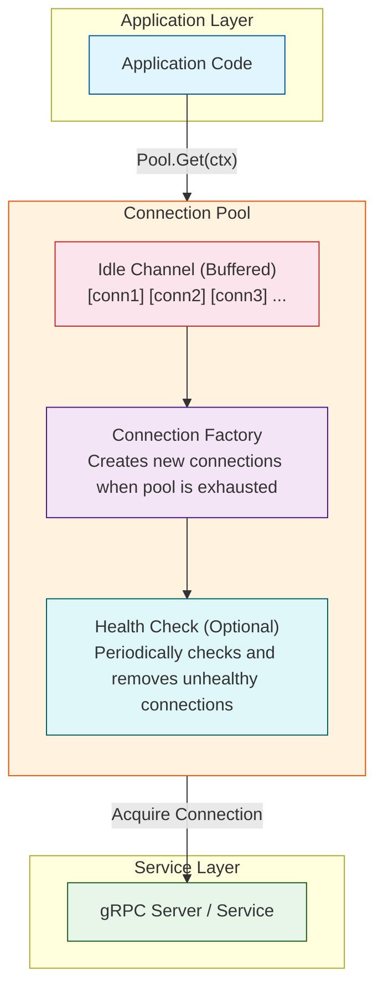

# grpc-go-pool

[](https://godoc.org/github.com/fishfinal/grpc-go-pool)
[](https://goreportcard.com/report/github.com/fishfinal/grpc-go-pool)
[](https://opensource.org/licenses/MIT)

A production-ready connection pool for gRPC Go clients with comprehensive lifecycle management and concurrent safety.

## 📚 Overview

`grpc-go-pool` provides a robust connection pool for gRPC clients with features including:
- Connection lifecycle management (idle timeout, max lifetime)
- Concurrent safe operations
- Automatic connection health checking
- Graceful shutdown with connection draining
- Comprehensive statistics and monitoring
- Configurable pool sizing

**Key Difference**: Unlike the client-side load balancing in the official gRPC package, this pool manages multiple connections to a single endpoint, which is particularly useful for server-side load-balanced scenarios.

## ✨ Features

- ✅ **Connection Pooling**: Maintains a pool of reusable gRPC connections
- ✅ **Idle Timeout**: Automatically recycles connections that have been idle too long
- ✅ **Max Lifetime**: Prevents connections from living indefinitely
- ✅ **Health Checking**: Periodic connection health verification
- ✅ **Concurrent Safe**: Thread-safe for high-concurrency scenarios
- ✅ **Graceful Shutdown**: Properly closes all connections on application shutdown
- ✅ **Metrics & Stats**: Built-in statistics for monitoring
- ✅ **Context Support**: Full context propagation for timeout and cancellation

## 📦 Installation

```bash
go get github.com/fishfinal/grpc-go-pool
```

## 🚀 Quick Start

```go
package main

import (
    "context"
    "log"
    "time"
    
    "github.com/fishfinal/grpc-go-pool"
    "google.golang.org/grpc"
    "google.golang.org/grpc/credentials/insecure"
)

func main() {
    // 1. Create a factory function
    factory := func() (*grpc.ClientConn, error) {
        return grpc.NewClient(
            "localhost:50051",
            grpc.WithTransportCredentials(insecure.NewCredentials()),
            grpc.WithDefaultCallOptions(grpc.MaxCallRecvMsgSize(1024*1024)),
        )
    }
    
    // 2. Create the connection pool
    pool, err := grpcpool.New(
        factory,
        5,                    // initial connections
        20,                   // max connections
        5*time.Minute,        // idle timeout
        30*time.Minute,       // max lifetime
    )
    if err != nil {
        log.Fatal("Failed to create pool:", err)
    }
    defer pool.Close()
    
    // 3. Get a connection from the pool
    ctx := context.Background()
    conn, err := pool.Get(ctx)
    if err != nil {
        log.Fatal("Failed to get connection:", err)
    }
    defer conn.Close()
    
    // 4. Use the connection for gRPC calls
    // client := pb.NewYourServiceClient(conn.ClientConn)
    // resp, err := client.YourMethod(ctx, req)
}
```

## 📖 Usage Guide

### Basic Usage

#### Creating a Pool

```go
// Basic pool with default settings
pool, err := grpcpool.New(
    factory,    // connection factory
    5,          // initial connections
    20,         // max capacity
    5*time.Minute, // idle timeout
)

// Pool with max lifetime
pool, err := grpcpool.New(
    factory,
    5,
    20,
    5*time.Minute,
    30*time.Minute, // max lifetime
)
```

#### Using Connections

**Option 1: Manual Management**
```go
conn, err := pool.Get(ctx)
if err != nil {
    return err
}
defer conn.Close()

// Use conn.ClientConn for gRPC calls
```

**Option 2: WithConn Helper**
```go
err := pool.WithConn(ctx, func(conn *grpc.ClientConn) error {
    // Use conn for gRPC calls
    return nil
})
```

**Option 3: MustGet (Panic on Error)**
```go
conn := pool.MustGet(ctx)
defer conn.Close()
```

### Advanced Configuration

#### Custom Factory with Context

```go
factory := func(ctx context.Context) (*grpc.ClientConn, error) {
    // Use context for timeout and cancellation
    return grpc.DialContext(
        ctx,
        "localhost:50051",
        grpc.WithInsecure(),
        grpc.WithBlock(),
    )
}

pool, err := grpcpool.NewWithContext(
    context.Background(),
    factory,
    5, 20, 5*time.Minute,
)
```

#### Load Balancing Example

```go
// Create multiple connections to a load-balanced endpoint
factory := func() (*grpc.ClientConn, error) {
    return grpc.NewClient(
        "loadbalancer.example.com:50051",
        grpc.WithInsecure(),
        grpc.WithDefaultServiceConfig(`{"loadBalancingPolicy":"round_robin"}`),
    )
}

pool, err := grpcpool.New(factory, 10, 50, time.Minute)
```

### Monitoring & Statistics

```go
// Get pool statistics
stats := pool.Stats()
fmt.Printf(`
Pool Stats:
  Total Created:    %d
  Total Destroyed:  %d
  Total Acquired:   %d
  Total Released:   %d
  Active Count:     %d
  Idle Count:       %d
  Waiting Count:    %d
  Capacity:         %d
  Closed:           %v
`, 
    stats["total_created"],
    stats["total_destroyed"],
    stats["total_acquired"],
    stats["total_released"],
    stats["active_count"],
    stats["idle_count"],
    stats["waiting_count"],
    stats["capacity"],
    stats["closed"],
)

// Monitor pool health
go func() {
    ticker := time.NewTicker(30 * time.Second)
    for range ticker.C {
        if pool.IsClosed() {
            return
        }
        log.Printf("Pool active: %d, idle: %d, available: %d",
            pool.ActiveCount(), pool.IdleCount(), pool.Available())
    }
}()
```

## 🛡️ Error Handling

```go
conn, err := pool.Get(ctx)
if err != nil {
    switch err {
    case grpcpool.ErrClosed:
        // Pool is closed, create a new one or fail
        return fmt.Errorf("pool is closed: %w", err)
    case grpcpool.ErrTimeout:
        // Get operation timed out
        return fmt.Errorf("get connection timeout: %w", err)
    case context.DeadlineExceeded:
        // Context deadline exceeded
        return fmt.Errorf("context deadline exceeded: %w", err)
    default:
        // Factory error or other issues
        return fmt.Errorf("failed to get connection: %w", err)
    }
}
defer conn.Close()
```

## 🧪 Testing

```bash
# Run all tests
go test -v ./...

# Run with race detector
go test -race ./...

# Run specific test
go test -run TestConcurrentGet -v
```

## 📊 Performance Tips

1. **Choose appropriate pool size**:
    - Minimum: `5-10` connections for low latency
    - Maximum: `50-100` for high throughput services
    - Monitor usage and adjust based on load

2. **Set reasonable timeouts**:
    - Idle timeout: `1-5 minutes` to balance resource usage
    - Max lifetime: `10-30 minutes` to avoid stale connections
    - Get timeout: `1-5 seconds` to prevent hanging

3. **Use contexts wisely**:
   ```go
   // Good: with timeout
   ctx, cancel := context.WithTimeout(context.Background(), 5*time.Second)
   defer cancel()
   conn, err := pool.Get(ctx)
   
   // Better: use request context
   conn, err := pool.Get(r.Context())
   ```

4. **Always defer Close()**:
   ```go
   conn, err := pool.Get(ctx)
   if err != nil {
       return err
   }
   defer conn.Close()
   ```

## 🔧 Configuration Options

| Parameter | Description | Recommended |
|-----------|-------------|-------------|
| `init` | Initial connections in pool | 5-10 |
| `capacity` | Maximum connections | 20-50 |
| `idleTimeout` | Idle connection timeout | 1-5 minutes |
| `maxLifeDuration` | Max connection lifetime | 10-30 minutes |

## 🏗️ Architecture



## 🔍 Debugging

Enable debug logging:
```go
import "log"

// Enable debug mode
pool.SetDebug(true) // hypothetical debug mode
```

Common issues and solutions:

1. **Connection leaks**: Ensure all `conn.Close()` are called (prefer `defer`)
2. **Pool exhaustion**: Increase `capacity` or reduce operation time
3. **Timeouts**: Check network latency and server response times
4. **Stale connections**: Adjust `maxLifeDuration` and `idleTimeout`

## 🤝 Contributing

Contributions are welcome! Please:

1. Fork the repository
2. Create a feature branch
3. Write tests for new features
4. Ensure all tests pass (`go test -race ./...`)
5. Submit a pull request

## 📄 License

MIT License - see [LICENSE](LICENSE) file for details

## 🙏 Acknowledgments

- Original implementation by [processout/grpc-go-pool](https://github.com/processout/grpc-go-pool)
- Inspired by various connection pool implementations in the Go ecosystem

## 📞 Support

- Issues: [GitHub Issues](https://github.com/fishfinal/grpc-go-pool/issues)
- Documentation: [GoDoc](https://godoc.org/github.com/fishfinal/grpc-go-pool)

---

Made with ❤️ for the Go community
